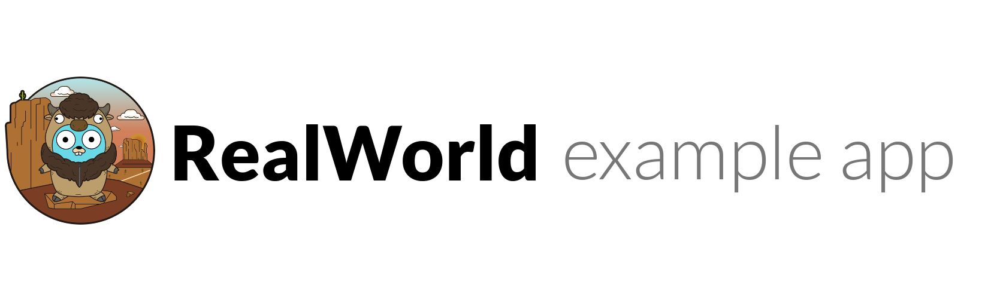

# 

> ### Buffalo codebase containing real world examples (CRUD, auth, advanced patterns, etc) that adheres to the [RealWorld](https://github.com/gothinkster/realworld) spec and API.

### Demo(not yet)&nbsp;&nbsp;&nbsp;&nbsp;RealWorld(not yet)

This codebase was created to demonstrate a fully fledged fullstack application built with **[Buffalo](http://gobuffalo.io)** including CRUD operations, authentication, routing, pagination, and more.

We've gone to great lengths to adhere to the **[Buffalo](http://gobuffalo.io)** community styleguides & best practices.

For more information on how to this works with other frontends/backends, head over to the [RealWorld](https://github.com/gothinkster/realworld) repo.

# How it works

> Describe the general architecture of your app here

# Getting started

## 1. Start the app

	buffalo dev

## 2. Start the database

	docker run --name rw_db -e POSTGRES_DB=gobuff_realworld_example_app_development -e POSTGRES_PASSWORD=postgres -e POSTGRES_USER=postgres -p 5432:5432 -d postgres

## 3. Update the database

	buffalo pop migrate

If you point your browser to [http://127.0.0.1:3000](http://127.0.0.1:3000) you should see the home page.